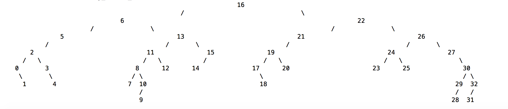

# Binary Search Tree

Binary Search Tree in C. Uses malloc() to create nodes with appropriate memory allocation, the clearTree() function frees all the allocated memory of the tree starting with the deepest nodes.

Has a visualization function to view the tree.

TO RUN (currently generating random tree with nodes 0-32): ```./bst```

TO COMPILE: ```gcc -o bst bst_node.c bst_tree_fncs.c bst_visualize.c bst.c```

## Screenshots:


