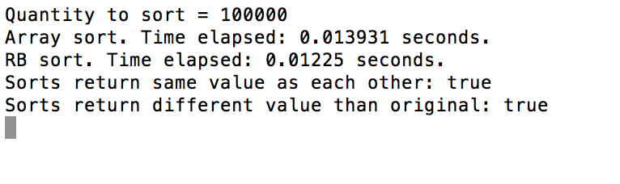

# RB's Bucket Sort

This Array sorting algorithm uses only linear time complexity, yet it requires an unsorted array of unique positive integers.

To sort, it first finds the max + 1 of the array, it then creates a new bucket array of that length, and then iterates through the original array and modulos each item in the array and places it at that position in the bucket array.

It then compacts the array and outputs the result.

Because of it's time complexity this sorting algorithm outperforms ruby's built in sorting algorithm after a certain point, but then the space complexity makes it take longer once it reaches another point.

## Examples:

